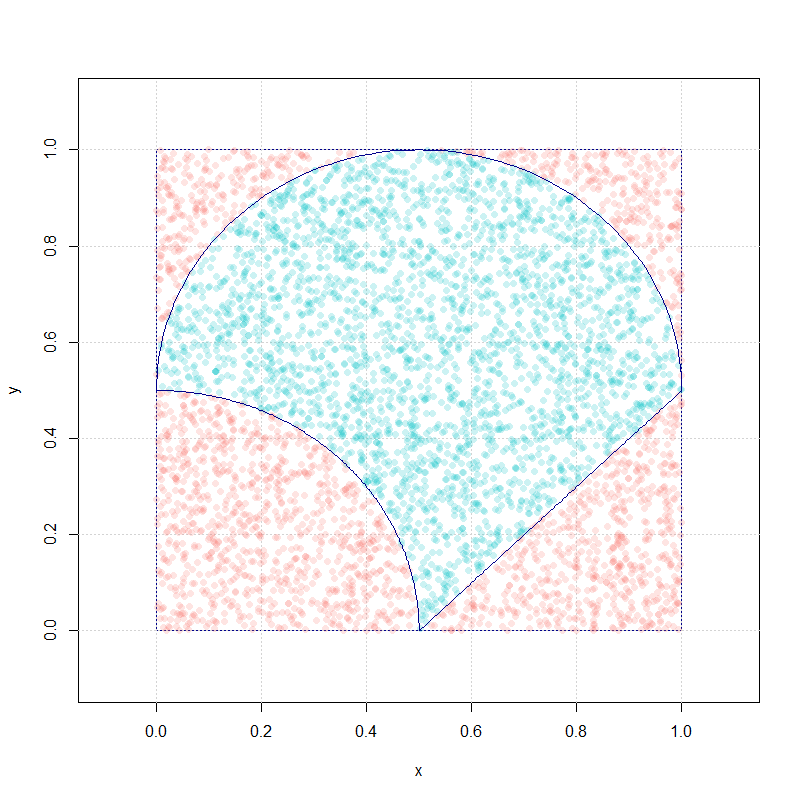
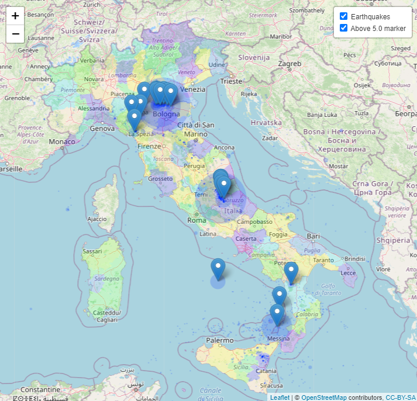
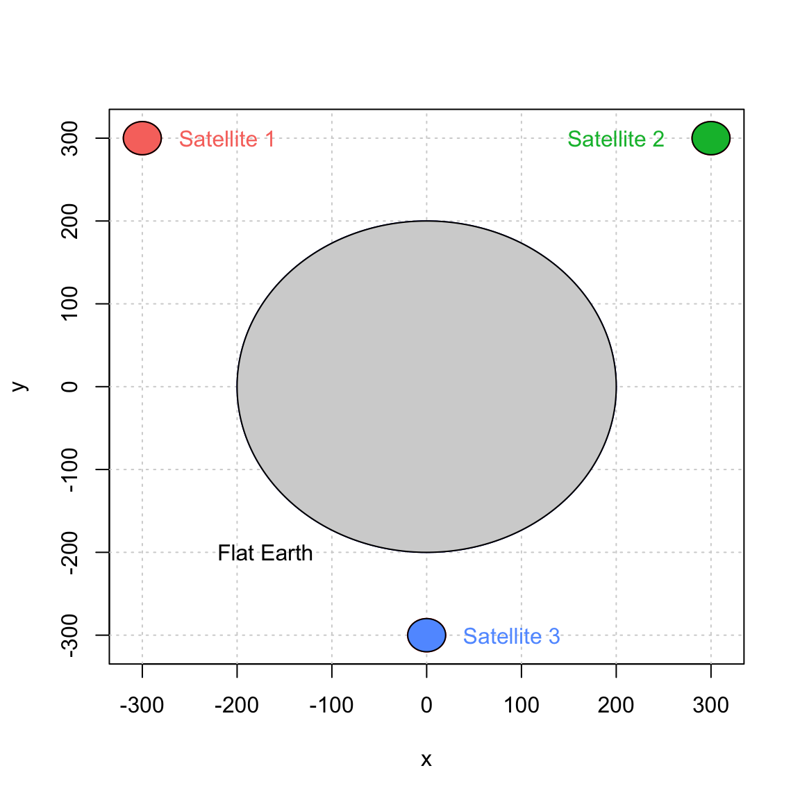
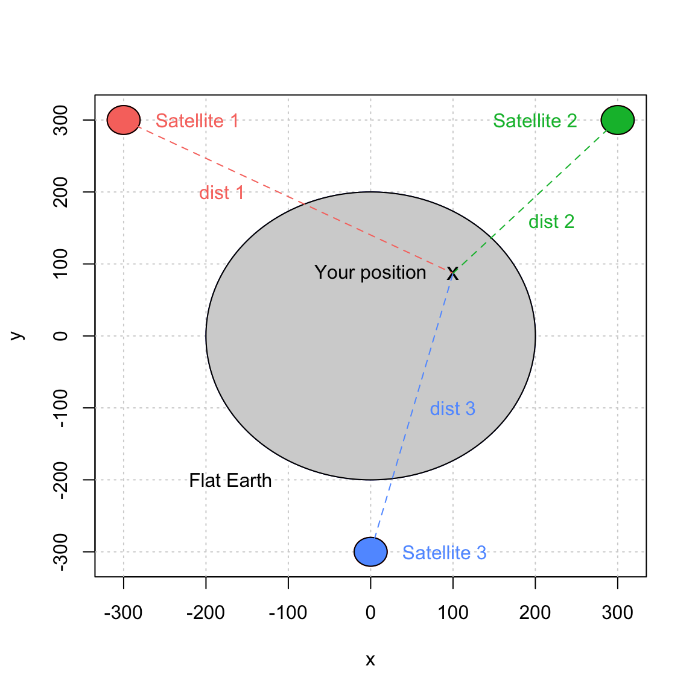
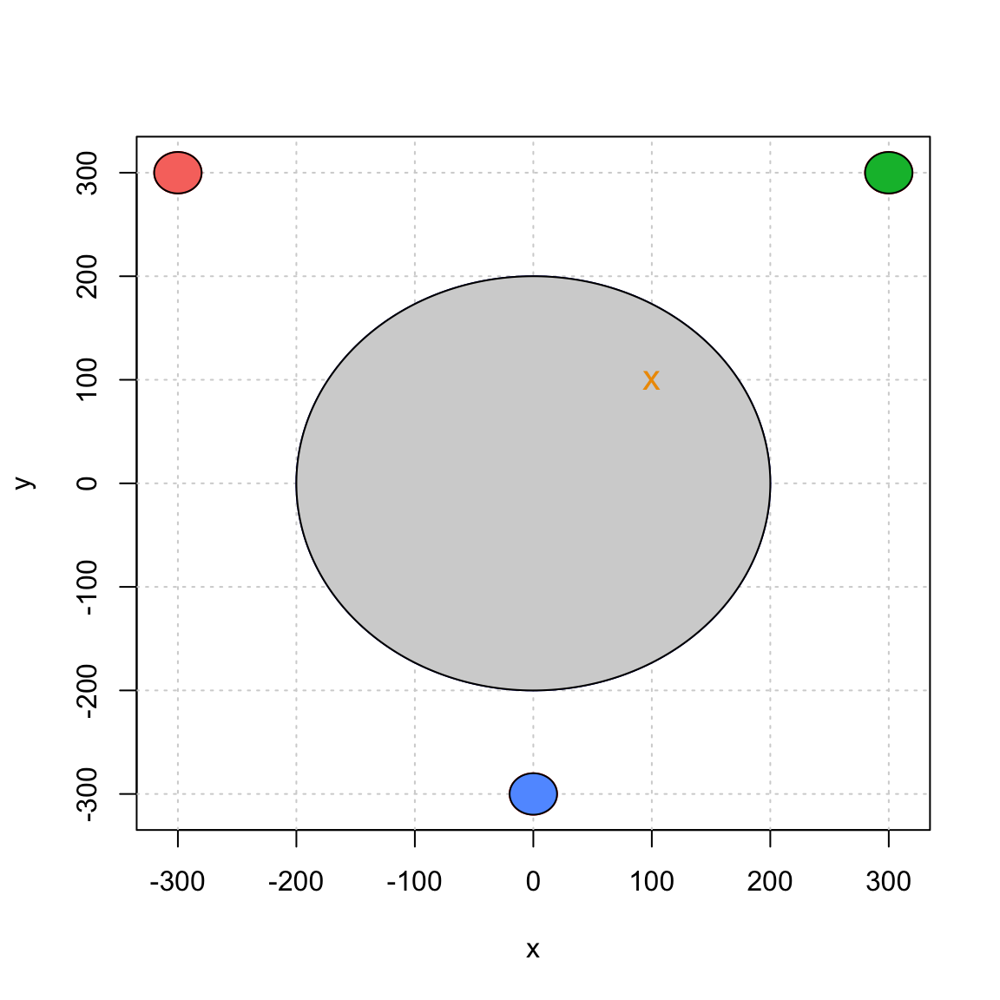
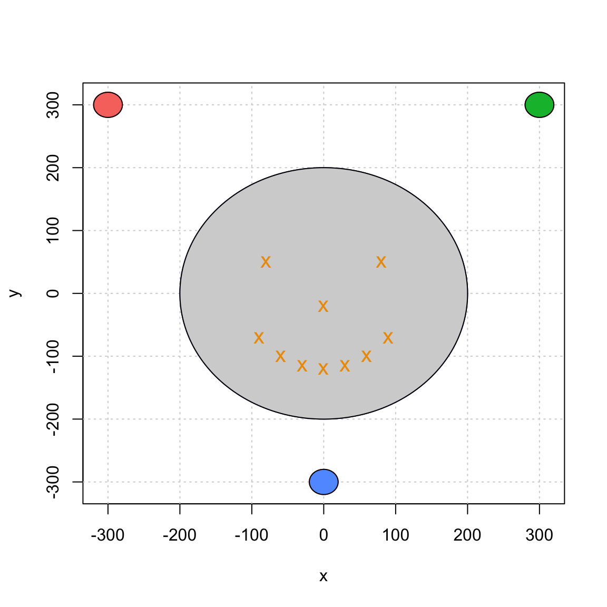

# Exercise 3 Solution

## Objectives :full_moon_with_face: 
- Learn how to program effectively using functions and think like a programmer;
- Become familiar with webscraping; 
- Learn how to solve some optimization problems.

## Content :rocket: 

#### Problem 1: Finding area of a shape
In this problem, we consider a Monte-Carlo approach for approximating the area of a shape $S$ (that you assume you do not know). To start with, let us consider a unit square, which has an area of 1, and consider the shape $S$, which is an intersection of three regions $S = D_1 \cap D_2 \cap D_3 $, where

$$D_1: x^2 + y^2 > 0.5^2; \quad D_2: (x - 0.5)^2 + (y - 0.5)^2 < 0.5^2; \quad D_3: y > x - 0.5.$$

Let us assume that the x and y coordinates are uniformly distributed between 0 and 1, that is $X\sim\mathcal{U}(0, 1)$ and $Y\sim\mathcal{U}(0, 1)$. We consider the following method for estimating the area of this circle:
1. Simulate $B$ coordinates $[X_i,\; Y_i]^T$, $i=1,\dots,B$.
2. Create a vector of Booleans $Z$, such that $Z_i = 1$ if $(X_i, Y_i) \in S$ and 0 otherwise.
3. Estimate $\mathrm{area}(S)$ as follows:

$$\text{area of the square } \times \frac{\text{number of points in the } S}{\text{total number of points}} = \frac{\displaystyle\sum_{i=1}^{B} Z_i}{B}.$$

*If you want to understand why this method works, see the bottom of the page.*

**a)** Create a function that approximates $\mathrm{area}(S)$ following the above recipe. Your function should be called `find_area()` and should have three arguments:

  + `B`: the number of points for the approximation with defaults value = 5000,
  + `seed`: a positive integer that controls the generation of random numbers with default value = 10,
  + `make_plot`: a Boolean value that control whether or a not a graph should be made (see below for details and use FALSE as default).

Your function should look like:

```{r}
find_area <- function(B = 5000, seed = 10, make_plot = FALSE){
  # Control seed
  set.seed(seed)
  # Simulate B points
  point = matrix(runif(2*B, 0, 1), nrow = B, ncol = 2)
 ...
 return(area_hat)
}
```

When enabling the plot by setting `make_plot = TRUE`, the function `find_area()` should produce a graph with a square, the shape of $S$ inside, and the `B` points with two distinct colors according to whether the point is inside or outside the circle. See below for an example.



**b)** Verify that by running `find_area(B=10^6, make_plot = TRUE)` the function returns the value $0.571741$. Compare it to the real area of the shape $S$ (calculate it using simple school formulas).


#### Problem 1: Solution

```{r}
make_circle <- function(col = "darkblue", fill = NULL, lty = 1) {
  phi <- seq(from = pi/2, to = 0, length.out = 201)
  f1_points <- cbind(.5 * cos(phi), .5 * sin(phi))
  
  phi <- seq(from = 0, to = pi, length.out = 101)
  f2_points <- cbind(.5 + .5 * cos(phi), .5 + .5 * sin(phi))
  
  x <- seq(from = .5, to = 1, length.out = 101)
  f3_points <- cbind(x, x - .5)
  
  coords = rbind(f2_points, f1_points, f3_points)
  
  lines(coords, col = col, lty = lty)
  if (!is.null(fill)){
    polygon(c(coords[,1]), c(coords[,2]), col = fill, border = NULL)
  }
}


make_square <- function(bottom_left = c(0,0), side = 1, col = "darkblue", fill = NULL){
  lines(c(bottom_left, bottom_left), c(bottom_left + side, bottom_left), col = col)
  lines(c(bottom_left + side, bottom_left), c(bottom_left + side, bottom_left + side), col = col)
  lines(c(bottom_left + side, bottom_left + side), c(bottom_left, bottom_left + side), col = col)
  lines(c(bottom_left, bottom_left + side), c(bottom_left, bottom_left), col = col)
  
  if (!is.null(fill)){
    polygon(c(bottom_left, bottom_left+side, bottom_left+side, bottom_left), c(bottom_left, bottom_left, bottom_left+side, bottom_left+side), border = NULL, col = fill)
  }
}


inside_region <- function(x, ind = NULL) {
  if (is.null(ind)) {
    stop("Index should be supplied to calculate the are border.")
  }
  
  if (ind == 1) {
    I <- x[1]^2 + x[2]^2 > .5^2
  } else if (ind == 2) {
    I <- (x[1] - .5)^2 + (x[2] - .5)^2 < .5^2
  } else if (ind == 3) {
    I <- x[2] > x[1] - .5
  }
  
  return(I)
}


inside_shape <- function(x){
  if (inside_region(x, 1) && inside_region(x, 2) && inside_region(x, 3)) {
    return(1)
  } else {
    return(0)
  }
}


find_area <- function(B = 5000, seed = 10, make_plot = TRUE){
  # Control seed
  set.seed(seed)
  
  # Simulate B points
  point = matrix(runif(2*B, 0, 1), B, 2)
  
  # Compute the number of points inside unit circle
  nb_inside = apply(point, 1, inside_shape)
  area_hat = sum(nb_inside)/B
  
  # Make plot
  if (make_plot){
    plot(NA, xlim = c(-0.1,1.1), ylim = c(-0.1,1.1), xlab = "x", ylab = "y")
    make_square()
    cols = hcl(h = seq(15, 375, length = 3), l = 65, c = 100, alpha = 0.2)[1:2]
    grid()
    for (i in 1:B){
      points(point[i,1], point[i,2], pch = 16, col = cols[1 + nb_inside[i]])
    }
    make_circle()
  }
  
  # return estimated value of pi
  return(area_hat)
}


B = seq(from = 10^3, to = 10^5, by = 500)
val <- numeric(length(B))
for (k in 1 : length(B)) {
  val[k] <- find_area(B[k], make_plot = FALSE)
}
```


#### Problem 2: Find SMI data
In the portfolio construction problem of the previous exercise (Problem 3), you were handed the `stocks.rds` containing stock data for S&P500 companies for the the past three years. Helping yourselves with the solution, webscrap the Swiss Market Index for 5 years. Hint: think of adding `".SW"` on the tickers in order to fetch data on Yahoo finance (through `quantmod` package).


#### Problem 2: Solution

```{r}
library(quantmod)
library(rvest)

smi <- read_html("https://en.wikipedia.org/wiki/Swiss_Market_Index")

smi_table <- smi %>% html_nodes("p + p + table") %>% html_table() %>% .[[1]]
smi_ticker <- smi_table$Ticker
smi_ticker <- paste0(smi_ticker, ".SW")

# Specify timing
tot_length <- 5 * 365 
today <- Sys.Date()
seq_five_years <- seq(today,by=-1,length.out=tot_length)
five_year_ago <- seq_five_years[tot_length]

# Retrieve data for a stock
i <- 1
getSymbols(smi_ticker[i],from=five_year_ago,to=today)
stock_price <- ClCl(get(smi_ticker[i]))

stocks <- matrix(nr=length(seq_five_years),nc=length(smi_ticker))
rownames(stocks) <- seq_five_years
colnames(stocks) <- smi_ticker

for(i in seq_along(smi_ticker)){
  getSymbols(smi_ticker[i],from=five_year_ago,to=today)
  stock_price <- ClCl(get(smi_ticker[i]))
  index <- rownames(stocks) %in% as.numeric(time(stock_price))
  stocks[index,i] <- stock_price
  print(i)
}

rownames(stocks) <- as.character(seq_five_years)
```


#### Problem 3: Map earthquakes 
This exercise is designed as a guided tutorial to the basic functions of the `leaflet` and `maps` packages that allow to draw maps and display information on them. First of all, if not done already, install `leaflet` and `maps` and load them into `R`.

- **(a)** Create a simple map by using the `addTiles()` function with its first argument being `leaflet()` and display the resulting map.
- **(b1)** On the map from point (a), add a marker with the help of the `addMarkers` function at $(\text{lon}, \text{lat})=(6.581188,46.522451)$ with a popup message specifying "University of Lausanne".
- **(b2)** On the same map display one favorite place in Switzerland for each member of your team. To do so, create a `data.frame` (or `tibble`), find all corresponding coordinates, add the names of the places, add use `addMarkers` to the result of (b1).
- **\(c)** Using the `map` function from the `maps` package, display a map of Italy with different colors for the various regions in this country, using the `addPolygons` function. See [color options](https://stat.ethz.ch/R-manual/R-devel/library/grDevices/html/palettes.html) for filling the polygons.
- **(d)** Download and load the `ETAS` package in order to retrieve some earthquakes data for Italy, that are stored in the aforementioned package as `italy.quakes` (assign it to a variable into your `R`). Filter for earthquakes of magnitude greater than (or equal to) 4.0 on the Richter scale and add markers with popups on the various localization of these earthquakes with their respective magnitudes.
- **(e)** On the previous map in point (d), instead of simple markers, add circle for each of the earthquake using the `addCircles` function and let the size of the circle vary with the magnitude of the earthquake. Add markers for the earthquakes that have more or equal than 5.0 magnitude with a popup of the corresponding number. Finally, use `addLayersControl` to distinguish on the map between two types of datatips (groups): the circles of all earthquakes, and the markers of the earthquakes of a magnitude 5.0 or higher, using the `overlayGroups` parameter.  Your final map should look similar to the following:




#### Problem 3: Solution 
-**(a)** To do so, simply use `addTiles` and `leaflet` in the following way: 

```{toml}
map <- leaflet() %>% addTiles()
map
```

Here, `%>%` is the [pipe operator](https://www.datacamp.com/community/tutorials/pipe-r-tutorial).

-**(b)** For a mere example of how to include multiple coordinates and names of the places, we construct a `data.frame` with fields `University of Lausanne` and `EPFL`, and find their coordinates.

```{toml}
uni <- data.frame(
  name = c("University of Lausanne", "EPFL"),
  lng = c(6.581188, 6.5668),
  lat = c(46.522451, 46.5191)
)
```

Adding the `addMarkers` option leads to the solution: 

```{toml}
map %>% addMarkers(lng = uni$lng, lat = uni$lat, popup = uni$name)
```

-**(c)** First, one needs to create the map from the `maps` package. Then, one should use it as a data argument in the `leaflet` function and colour accordingly. 

```{toml}
map_italy <- map("italy", plot = FALSE)
map_italy <- map_italy %>%
  leaflet() %>%
  addTiles() %>%
  addPolygons(fillColor = topo.colors(10, alpha = 1), stroke = FALSE)
map_italy
```

-**(d)** One obtains the solution by first loading the data, restricting the scope of the dataset to events with magnitude larger than 4.0 and by finally adding the marker points using the `addPolygons`. 

```{toml}
library(ETAS)
quakes <- italy.quakes
quakes_4 <- quakes[quakes$mag > 4, ]
map_italy %>%
  addMarkers(
    lng = quakes_4$long,
    lat = quakes_4$lat,
    popup = as.character(quakes_4$mag)
  )
```

-**(e)** To solve this problem, we filter the earthquakes that have the magnitude of 5.0 or more and store it in `quakes_5more`, add circles around each earthquake in the data set using `addCircles` with `radius` $= 10^\text{magnitude} / 10$, add markers for the `quakes_5more` earthquakes, and finally add the layer control.

```{toml}
quakes_5more <- quakes[quakes$mag >= 5, ]
map_italy %>%
  addCircles(
    lng = quakes$long,
    lat = quakes$lat,
    radius = 10^quakes$mag/10,
    stroke = FALSE,
    group = "Earthquakes"
  ) %>%
  addMarkers(
    lng = quakes_5more$long,
    lat = quakes_5more$lat,
    popup = as.character(quakes_5more$mag),
    group = "Above 5.0 marker"
  ) %>%
  addLayersControl(
    overlayGroups = c("Earthquakes", "Above 5.0 marker"),
    options = layersControlOptions(collapsed = FALSE)
  )
```

 


#### Problem 4: Satellite Navigation System
Global Navigation Satellite Systems or GNSS are systems with global coverage that uses satellites to provide autonomous geo-spatial positioning. They allow small electronic receivers to determine their location (longitude, latitude, and altitude/elevation) to high precision (within a few meters) using time signals (i.e. "distances" informally speaking) transmitted along a line of sight by radio from satellites. Currently, there exist only three global operational GNSS, the United States' Global Positioning System (GPS), Russia's GLONASS and the European Union's Galileo. However, China is in the process of expanding its regional BeiDou Navigation Satellite System into a global system by 2020. Other countries, such as India, France or Japan are in the process of developing regional and global systems.

Obviously, GNSS are very complex systems and in this exercise we will consider an **extremely simplified** setting to illustrate the basic concepts behind satellite positioning. If you are interested in learning more about GNSS, an excellent introduction to get started this topics can be found here: "[An Introduction to GNSS](http://www.borealisprecision.com/pdf/An_Introduction_to_GNSS.pdf)".

For simplicity, let us start by assuming that the earth is a motionless perfect circle in a two-dimensional space. Next, we assume that three motionless GNSS-like satellites are placed around the earth. The position of these satellites is assumed to be known and we will assume that there are synchronized (i.e. they all have the same "time"). Our simplified setting can be represented as follows:


Now, suppose that you are somewhere on our flat earth with a GNSS-like receiver. The way you will be able to compute your position with such system is by first determining the distance (or a closely related notion) between yourself and with each satellite. The computation of these distances is done by comparing the time at which a signal is emitted by a satellite and the time at which it is received by your device. More precisely, let $t_e^{(i)}$ and $t_r^{(i)}$ denote, respectively, the times at which a signal is emitted and received for satellite $i$. To simplify further, we assume that $t_e^{(i)}$ (also known as the clock in each satellite) is "perfect" (this point may surprise you, but in reallity the time in the satellite are subjected to random variations). However, the clock in our device is not perfect and $t_r^{(i)}$ is estimated by $\hat{t}_r^{(i)}$ which represents the time recorded by the receiver device. Since all satellites are assumed to be synchronized, we can write $$\hat{t}_r^{(i)} = t_r^{(i)} + \Delta t,$$ where $\Delta t$ is the time difference, it is the same for all satellites as it does not depend on $i$. Using this simple result as well as the times $\hat{t}_r^{(i)}$ and ${t}_e^{(i)}$, we can compute the estimated distance between us and the $i$-th satellite as follows:

$$ \hat{d}_i = c\left[(t_r^{(i)} + \Delta t) - t_e^{(i)}\right] = c\left(t_r^{(i)}  - t_e^{(i)}\right) + c \Delta t = d_i + \varepsilon,$$

where $c$, $d_i$ and $\varepsilon$ denote, respectively, the speed of the signal, the true distance between us and the $i$-th satellite, and the measurement error. This setting can be represented as follows:



Next, we let $(x_i, y_i), \, i = 1,2,3$ denote the position of satellite $i$. The coordinates of these points are given in the table below:

$i$ | $x_i$ | $y_i$
:-- | :-- | :--
1 | -300 | 300
2 | 300 | 300
3 | 0 | -300

Finally, we let $(x_0, y_0)$ denotes our position on earth. Then, the distance between our position and the $i$-th satellite is given by

$$ d_i = \sqrt{\left(x_i - x_0\right)^2 + \left(y_i - y_0\right)^2}.$$

Unfortunately, $d_i$ is unknown (if our position were known, why using a GNSS system). Instead, we can express the distance as $d_i = \hat{d}_i - \varepsilon$. We obtain following system of equations:

$$ \begin{aligned} (x_1 - x_0)^2 + (y_1 - y_0)^2 &= (\hat{d}_1 - \varepsilon)^2 \\\  (x_2 - x_0)^2 + (y_2 - y_0)^2 &= (\hat{d}_2 - \varepsilon)^2 \\\  (x_3 - x_0)^2 + (y_3 - y_0)^2 &= (\hat{d}_3 - \varepsilon)^2, \end{aligned} $$

where $\boldsymbol{\theta}=[x_0, y_0, \varepsilon]^T$ are the three unknown quantities we wish to estimate and $\hat{d}_i,i = 1,2,3,$ are the observations.

While there exists several methods to solve such estimation problem, the most common is known as the "least-square adjustement" and will be used in this problem. It is given by:

$$ \hat{\boldsymbol{\theta}} = \operatorname{argmin}_{\boldsymbol{\theta}} \sum_1^3 \left[\left(x_i - x_0\right)^2 + \left(y_i - y_0\right)^2 - \left(\hat{d}_i - \varepsilon\right)^2\right]^2.$$

**a)** Write a general function named `get_position()` that takes as a single argument a vector of observed distances and returns an object with an appropriate class having custom `summary` and `plot` functions. For example, suppose we observe the vector of distances

$$ \hat{\mathbf{d}} = [\hat{d}_1, \hat{d}_2, \hat{d}_3]^T = [449.2136, 284.8427, 414.3106]^T,$$

then you should replicate (approximately) the following results:

```{r}
position = get_position(c(453.2136, 288.8427, 418.3106))
summary(position)
```

```{r}
## The estimated position is:
## X = 99.9958
## Y = 100.003
```

```{r}
plot(position)
```


Note that inside the `get_position()` function, you need to estimate the positions $\hat{x}$ and $\hat{y}$. You can use the R function `optim` for this purpose. It has the syntax:
```{r}
optim(par = starting_values, fn = my_objective_function, arg1 = arg1, ..., argN = argN)
```
The arguments are:
- `starting_values`: the starting values for the optimization, here a vector of three values corresponding to $\hat{\boldsymbol{\theta}}$.
- `my_objective_function`: the objective function, here the one we defined above. It **must** have $\boldsymbol\theta$ as one of its arguments.
- `arg1` to `argN`: additional arguments for the objective functions.

**b)** Generalize the function `get_position()` of the point **a)** to accept also a matrix of observed distances (but keep only one argument!).
**c)** Verify that the function you wrote at the point **b)** display the same graph
```{r}
position = get_position(dist_mat)
summary(position)
```


where the matrix inputed is
```{r}
##           [,1]     [,2]     [,3]
##  [1,] 458.9474 337.1013 363.1112
##  [2,] 337.0894 458.9355 363.0993
##  [3,] 442.5835 442.5835 283.9493
##  [4,] 520.1845 520.1845 184.0449
##  [5,] 534.1411 499.0299 191.3455
##  [6,] 499.1322 534.2434 191.4479
##  [7,] 542.0904 470.4216 212.7515
##  [8,] 470.4070 542.0758 212.7369
##  [9,] 541.6032 429.4569 250.9978
## [10,] 429.4120 541.5583 250.9528
```


#### Problem 4: Solution

```{r}
is_on_earth = function(x0, y0){
  sqrt(x0^2 + y0^2) < 200
}


get_distance = function(x0, y0, epsilon){
  x = c(-300, 300, 0)
  y = c( 300, 300, -300)
  d = sqrt((x0 - x)^2 + (y0 - y)^2) + epsilon
  return(d)
}


obj_gnss = function(theta, distance){
  x = c(-300, 300, 0)
  y = c( 300, 300, -300)
  x0 = theta[1]
  y0 = theta[2]
  epsilon = theta[3]
  sum(((x0 - x)^2 + (y0 - y)^2 - (distance - epsilon)^2)^2)
}


get_position = function(distance, start = rep(0, 3)){
  if (is.matrix(distance)){
    nb_points = dim(distance)[1]
    results = matrix(NA, nb_points, 3)
    for (i in 1:nb_points){
      results[i,] = optim(start, obj_gnss, distance = distance[i,])$par[1:3]
    }
    class(results) = "gnssmat"
  } else {
    results = optim(start, obj_gnss, distance = distance)
    results[[6]] = distance
    names(results) = c(names(results)[1:5], "distance")
    class(results) = "gnssvect"
  }
  results
}


plot.gnssvect = function(position, show.distance = FALSE, add = FALSE){
  cols = hcl(h = seq(15, 375, length = 4), l = 65, c = 100)[1:3]
  
  if (add == FALSE){
    cols_trans = hcl(h = seq(15, 375, length = 4), l = 65, c = 100, alpha = 0.75)[1:3]
    plot(NA, xlim = c(-310, 310), ylim = c(-310, 310), xlab = "x", ylab = "y")
    grid()
    make_circle(fill = "lightgrey", radius = 200)
    make_circle(radius = 20, center = c(-300, 300), col = "red", fill = cols[1])
    make_circle(radius = 20, center = c(300, 300), col = "red", fill = cols[2])
    make_circle(radius = 20, center = c(0, -300), col = "red", fill = cols[3])
  
    if (show.distance == TRUE){
      make_circle(radius = position$distance[1], center = c(-300, 300), col = cols_trans[1])
      make_circle(radius = position$distance[2], center = c(300, 300), col = cols_trans[2])
      make_circle(radius = position$distance[3], center = c(0, -300), col = cols_trans[3])
    }
  }
  points(position$par[1], position$par[2], pch = "x", cex = 1.3, col = "orange2")
}


plot.gnssmat = function(position){
  cols = hcl(h = seq(15, 375, length = 4), l = 65, c = 100)[1:3]
  cols_trans = hcl(h = seq(15, 375, length = 4), l = 65, c = 100, alpha = 0.75)[1:3]
  plot(NA, xlim = c(-310, 310), ylim = c(-310, 310), xlab = "x", ylab = "y")
  grid()
  make_circle(fill = "lightgrey", radius = 200)
  make_circle(radius = 20, center = c(-300, 300), col = "red", fill = cols[1])
  make_circle(radius = 20, center = c(300, 300), col = "red", fill = cols[2])
  make_circle(radius = 20, center = c(0, -300), col = "red", fill = cols[3])
  
  for (i in 1:dim(position)[1]){
    points(position[i,1], position[i,2], pch = "x", cex = 1.3, col = "orange2")
  }
}


summary.gnssvect = function(position){
  cat("The estimated position is:\n")
  cat("X = ")
  cat(round(position$par[1],4))
  cat("\n")
  cat("Y = ")
  cat(round(position$par[2],4))
  cat("\n\n")
}
```


#### Problem 5: optmization for logistic regression problem

This exercise is dedicated to code your own "logistic regression" using any arbitrary probability function and the `optim()` function.

Have a look at the tutorial on [logistic regression](https://ptds.samorso.ch/tutorials/logistic/), where a probability of _success_ is defined by the sigmoid function $\sigma(t) = (1 + e^{-t})^{-1}$. Now, to determine the probability of _success_ we consider the CDF of a standard Cauchy distribution

$$\sigma(t) = \frac{1}{\pi} \arctan (t) + \frac{1}{2}.$$

Similarly to the tutorial, further we express $t$ as a linear combination of known covariates $x$ and unknown coefficients $w$:

$$t = Xw.$$

We will compare a standard `glm` fit for the `titanic` data set with `family = binomial(link = "logit")` to our own model.
Your goal is to code the log likelihood function $\mathcal{L}$ of our model, fit the standard `glm` model for the training set (follow the tutorial), fit the Cauchy model, and finally, compare the results on the test set.

**(a)** Load the `titanic` data set. Create a training set `data_train` being $70\%$ of the data, and a test set `data_test` - the remaining $30\%$. Keep only the `Survived, Pclass, Sex, SibSp, Parch, Fare` columns. Fit the logistic regression on the training set with `Survived` being the response variable.

**(b)** Code the negative log likelihood function `nll(w, X, y)`, where `w` is a vector of unknown coefficients; `X` is a matrix $n \times 5$ of the observations; `y` is the response variable. Use optimisation function `optim()` with target `nll` and `method = "BFGS"`.

**\(c)** For both models calculate the survival probability of `data_test`. Using a threshold of 0.5, predict the survival as $\text{Survive} = \text{Prob} > 0.5$. Create two confusion matrices using, for example, `table()`, and compare the accuracies of both models. Which model performs better?


#### Problem 5: Solution

```{r}
library(titanic)
library(tidyverse)

data <- titanic_train %>% as_tibble() %>% 
  select(Survived, Pclass, Sex, SibSp, Parch, Fare) %>% 
  mutate(Sex = factor(Sex))


set.seed(1)
ind_train <- sample(1:nrow(data), size = .7*nrow(data), replace = FALSE)
data_train <- data[ind_train, ]
data_test <- data[-ind_train, ]


model_glm <- glm(Survived ~ ., data = data_train, family = binomial(link = "logit"))


sigma_f <- function(x) {
  1/pi * atan(x) + .5 
}

nll <- function(w, X, y) {
  xw <- X %*% w
  loglik <- y * log(sigma_f(xw) / (1 - sigma_f(xw))) + log(1 - sigma_f(xw))
  return(-sum(loglik))
}


X_data <- model.matrix(model_glm)
Y_data <- model_glm$y

model_cauchy <- optim(par = rep(0, 6), fn = nll, X = X_data, y = Y_data, method = "BFGS")

pred_glm <- predict(model_glm, newdata = data_test, type = "response") > .5

data_test_mat <- data_test %>% mutate(Sex = Sex == "male") %>% as.matrix()
pred_cauchy <- sigma_f(data_test_mat %*% model_cauchy$par) > .5

table(data_test$Survived, pred_glm)
table(data_test$Survived, pred_cauchy)
```
